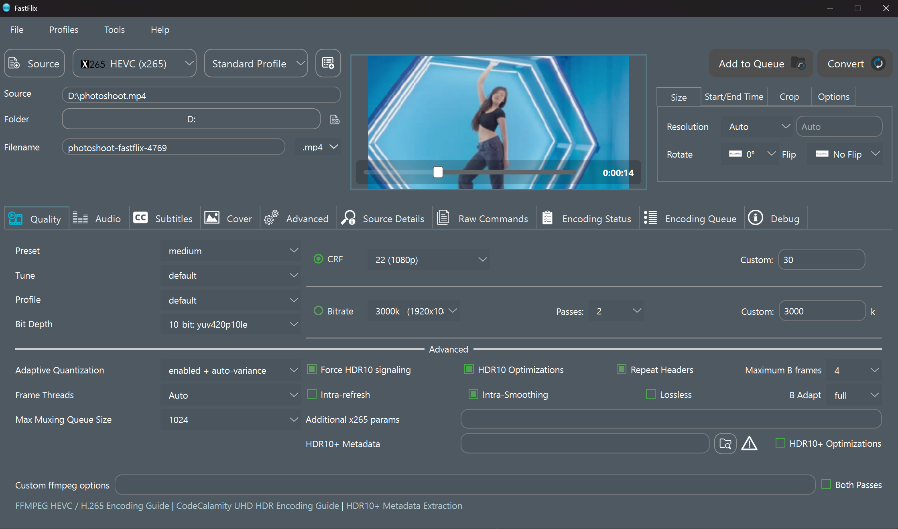

# FastFlix

FastFlix is a handy GUI for encoding videos. 

[Download latest release from Github](https://github.com/cdgriffith/FastFlix/releases/latest)

It needs `FFmpeg` (version 4.3 or greater required, 5.0+ recommended) under the hood for the heavy lifting, and can work with a variety of encoders.

Check out [the FastFlix github wiki](https://github.com/cdgriffith/FastFlix/wiki) for help or more details, and please report bugs in the [github issue tracker](https://github.com/cdgriffith/FastFlix/issues)!

#  Encoders

## Software Encoders

| Encoder   | x265 | x264 | rav1e | AOM AV1 | SVT AV1 | VP9 | VVC |
|-----------|------|------|-------|---------|---------|-----|-----|
| HDR10     | ✓    |      | ✓     | ✓       | ✓       | ✓*  | ✓   |
| HDR10+    | ✓    |      |       |         |         |     |     |
| Audio     | ✓    | ✓    | ✓     | ✓       | ✓       | ✓   | ✓   |
| Subtitles | ✓    | ✓    | ✓     | ✓       | ✓       |     | ✓   |
| Covers    | ✓    | ✓    | ✓     | ✓       | ✓       |     | ✓   |
| bt.2020   | ✓    | ✓    | ✓     | ✓       | ✓       | ✓   | ✓   |

If one of the above software encoders is not listed, it is due to your version of FFmpeg not having that encoder compiled in.

## Hardware Encoders 

These will require the appropriate hardware. Nvidia GPU for NVEnc, Intel GPU/CPU for QSVEnc, AMD GPU for VCEEnc,
or compatible hardware for VAAPI (Linux) and Apple VideoToolbox (macOS).

Most of the Nvidia, Intel, and AMD encoders are using [rigaya's hardware encoders](https://github.com/rigaya?tab=repositories) that must be downloaded separately,
extracted to a directory of your choice, and then linked to in FastFlix Settings panel.

### AV1

AV1 is only supported on the latest generation of graphics cards specifically the Intel Arc, Nvidia 4000 series and AMD 7000 series 

| Encoder   | [NVEncC AV1](https://github.com/rigaya/NVEnc/releases) | [QSVEncC AV1](https://github.com/rigaya/QSVEnc/releases) | [VCEEncC AV1](https://github.com/rigaya/VCEEnc/releases) |
|-----------|--------------------------------------------------------|----------------------------------------------------------|----------------------------------------------------------|
| HDR10     | ✓                                                      | ✓                                                        | ✓                                                        |
| HDR10+    | ✓                                                      | ✓                                                        | ✓                                                        |
| Audio     | ✓*                                                     | ✓*                                                       | ✓*                                                       |
| Subtitles | ✓                                                      | ✓                                                        | ✓                                                        |
| Covers    |                                                        |                                                          |                                                          |
| bt.2020   | ✓                                                      | ✓                                                        | ✓                                                        |

### HEVC / H.265

| Encoder   | NVENC HEVC (ffmpeg) | [NVEncC HEVC](https://github.com/rigaya/NVEnc/releases) | [VCEEncC HEVC](https://github.com/rigaya/VCEEnc/releases) | [QSVEncC HEVC](https://github.com/rigaya/QSVEnc/releases) |
|-----------|---------------------|---------------------------------------------------------|-----------------------------------------------------------|-----------------------------------------------------------|
| HDR10     |                     | ✓                                                       | ✓                                                         | ✓                                                         |
| HDR10+    |                     | ✓                                                       | ✓                                                         | ✓                                                         |
| Audio     | ✓                   | ✓*                                                      | ✓*                                                        | ✓*                                                        |
| Subtitles | ✓                   | ✓                                                       | ✓                                                         | ✓                                                         |
| Covers    | ✓                   |                                                         |                                                           |                                                           |
| bt.2020   | ✓                   | ✓                                                       | ✓                                                         | ✓                                                         |

### AVC / H.264

| Encoder   | [NVEncC AVC](https://github.com/rigaya/NVEnc/releases) | [VCEEncC AVC](https://github.com/rigaya/VCEEnc/releases) | [QSVEncC AVC](https://github.com/rigaya/QSVEnc/releases) |
|-----------|--------------------------------------------------------|----------------------------------------------------------|----------------------------------------------------------|
| HDR10     |                                                        |                                                          |                                                          |
| HDR10+    |                                                        |                                                          |                                                          |
| Audio     | ✓*                                                     | ✓*                                                       | ✓*                                                       |
| Subtitles | ✓                                                      | ✓                                                        | ✓                                                        |
| Covers    |                                                        |                                                          |                                                          |
| bt.2020   | ✓                                                      | ✓                                                        | ✓                                                        |

### Apple VideoToolbox (macOS)

| Encoder   | H264 VideoToolbox | HEVC VideoToolbox |
|-----------|-------------------|-------------------|
| HDR10     |                   |                   |
| HDR10+    |                   |                   |
| Audio     | ✓                 | ✓                 |
| Subtitles | ✓                 | ✓                 |
| Covers    | ✓                 | ✓                 |
| bt.2020   | ✓                 | ✓                 |

### VAAPI (Linux)

| Encoder   | VAAPI H264 | VAAPI HEVC | VAAPI VP9 | VAAPI MPEG2 |
|-----------|------------|------------|-----------|-------------|
| HDR10     |            |            |           |             |
| HDR10+    |            |            |           |             |
| Audio     | ✓          | ✓          | ✓         | ✓           |
| Subtitles | ✓          | ✓          | ✓         | ✓           |
| Covers    |            |            |           |             |
| bt.2020   | ✓          | ✓          | ✓         | ✓           |

`✓ - Full support   |   ✓* - Limited support`

# Releases

View the [releases](https://github.com/cdgriffith/FastFlix/releases) for binaries for Windows, MacOS or Linux

You will need to have `ffmpeg` and `ffprobe` executables on your PATH and they must be executable. Version 4.3 or greater is required for most usage, latest master build is recommended and required for some features. The one in your package manager system may not support all encoders or options.
Check out the [FFmpeg download page for static builds](https://ffmpeg.org/download.html) for Linux and Mac.

# Additional Encoders

To use rigaya's [Nvidia NVENC](https://github.com/rigaya/NVEnc/releases), [AMD VCE](https://github.com/rigaya/VCEEnc/releases), and [Intel QSV](https://github.com/rigaya/QSVEnc/releases) encoders, download them and extract them to folder on your hard drive. 

Windows: FastFlix can automatically download rigaya's encoders for you from the Settings panel. Alternatively, you can manually select the corresponding EXE file for each encoder.

Linux: Install the rpm or deb and restart FastFlix

# HDR

On any 10-bit or higher video output, FastFlix will copy the input HDR colorspace (bt2020). Which is [different than HDR10 or HDR10+](https://codecalamity.com/hdr-hdr10-hdr10-hlg-and-dolby-vision/).

## HDR10

FastFlix was created to easily extract / copy HDR10 data, which it can do with the above listed encoders (x265, NVEncC, VCEEncC, QSVEncC).

VP9 has limited support to copy some existing HDR10 metadata, usually from other VP9 files. Will have the line "Mastering Display Metadata, has_primaries:1 has_luminance:1 ..." when it works.

AV1 HDR10 support varies by encoder:

* QSVEnc - Works!
* NVEncC - Works!
* VCEEncC - Works!
* rav1e - Works! Mastering display and content light level passed via rav1e-params.
* SVT AV1 - Works! Supports HDR10 with latest ffmpeg build.
* aomenc (libaom-av1) - HDR10 color metadata (bt.2020/PQ) is passed through, but mastering display and content light level rely on FFmpeg's automatic side data passthrough.

## HDR10+

For Windows users with dedicated graphics cards, the best thing to do is use a hardware encoder, as they all support HDR10+ currently!

FastFlix also supports using generated or [extracted JSON HDR10+ Metadata](https://github.com/cdgriffith/FastFlix/wiki/HDR10-Plus-Metadata-Extraction) with HEVC encodes via x265. However, that is highly
dependent on a FFmpeg version that has been compiled with x265 that has HDR10+ support. [BtbN's Windows FFmpeg builds](https://github.com/BtbN/FFmpeg-Builds) 
have this support as of 10/23/2020 and may require a [manual upgrade](https://github.com/cdgriffith/FastFlix/wiki/Updating-FFmpeg).

If you add HDR10+ metadata file, make sure the encoding log does NOT contain the line `x265 [warning]: –dhdr10-info disabled. Enable HDR10_PLUS in cmake` or else it is unsupported. 

## HLG 

FastFlix (v4.0.2+) passes through HLG color transfer information to everything except webp and GIF. 

## Dolby Vision

FastFlix v6.0.0+ supports copying existing Dolby Vision metadata from the input video for HEVC and AV1 videos used with rigaya's hardware encoders.

# Multilingual Support

FastFlix is machine translated using DeepL into Spanish (español), French (Français), German (Deutsch), 
Italian (Italiano), Chinese (中文), Japanese (日本語), Portuguese (Português), Swedish (svenska), Ukrainian (Українська),
Russian (русский), Polish (polskie), Korean (한국어), Romanian.

If something sounds wrong in your language, please open an issue with which line in
[the language file](https://github.com/cdgriffith/FastFlix/blob/master/fastflix/data/languages.yaml) needs fixed!

Special thanks to [leonardyan](https://github.com/leonardyan) for numerous Chinese corrections,
[Ta0ba0](https://github.com/Ta0ba0) for the Russian language updates and 
[bovirus](https://github.com/bovirus) for Italian language updates!

# Subtitle Extraction

FastFlix can extract subtitle tracks from video files. Text-based subtitles (SRT, ASS, SSA) are extracted directly using FFmpeg.

## PGS to SRT OCR Conversion

FastFlix supports converting PGS (Presentation Graphic Stream) image-based subtitles to SRT text format using OCR. This is useful for Blu-ray rips and other sources that use picture-based subtitles.

For PGS tracks, the subtitle panel offers two options:
- **Extract as .sup** (fast) - extracts the raw PGS image subtitle
- **Convert to .srt** (OCR, 3-5 min) - extracts and converts to searchable text using OCR

**Requirements (auto-detected from system PATH, standard install locations, or Windows registry)**:
- [Tesseract OCR](https://github.com/tesseract-ocr/tesseract) 4.x or higher
- [MKVToolNix](https://mkvtoolnix.download/) (mkvextract/mkvmerge)

FastFlix will show the detection status of these tools in the Settings panel under "Detected External Programs".

# License

Copyright (C) 2019-2026 Chris Griffith

The code itself is licensed under the MIT which you can read in the `LICENSE` file.  
Read more about the release licensing in the [docs](docs/README.md) folder.  

Custom icons designed by Joey Catt | Onyx Studios

Encoder icons for [VP9](https://commons.wikimedia.org/wiki/File:Vp9-logo-for-mediawiki.svg), [AOM AV1](https://commons.wikimedia.org/wiki/File:AV1_logo_2018.svg) and [VVC](https://en.wikipedia.org/wiki/File:Versatile_Video_Coding_(logo).svg) are from Wikimedia Commons all others are self created.

Additional button icons from [https://uxwing.com](https://uxwing.com)

Sample videos and thumbnail for preview image provided by [Jessica Payne](http://iamjessicapayne.com/)
